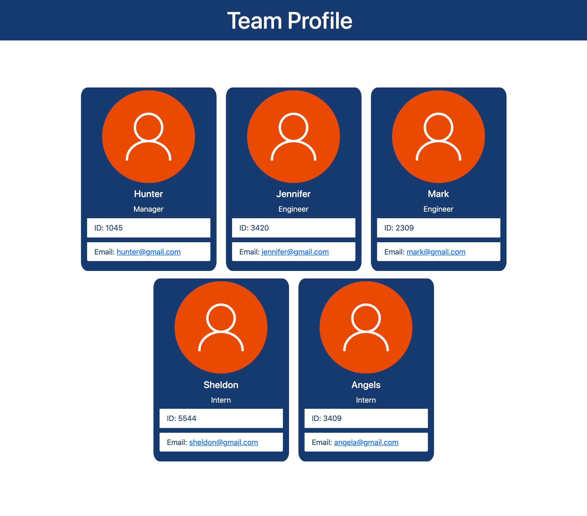
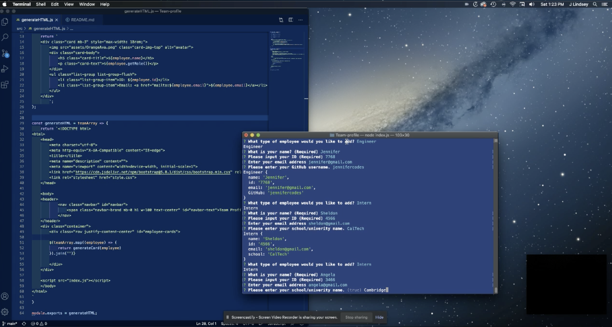

# Team Profile Builder

## **Description**
This application was created to generate your team's profile based on user input using Node.js. Build your Team's online profile, incl. Name/Title/ID/Email  to generate your HTML.

## **Table of Contents**
* [Installation](#installation)
* [Usage](#usage)
* [Contributions](#contributions)
* [Licenses](#licenses)
* [Badges](#Badges)
* [Questions](#questions)

### **Installation**
npm
inquirer

### **Usage**
⏯

### **Technologies Used:**
* Node.js
* JavaScript
* npm
* CSS
* Bootstrap
* HTML

### *Contributions*

### *Licenses*
MIT license

### *Badges*

### *Questions*
If you have any questions, reach out to me on Git Hub https://github.com/JJLindsey, or send me a message jlindsey010@gmail.com.

©Jennifer Lindsey 2021